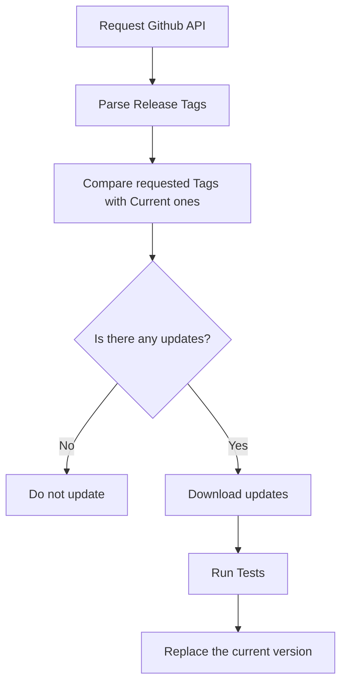

# OTA Plan

This document describes the OTA workflow

## Workflow

This graph shows the current workflow for the OTA upates

## Clarifications.

- The release tag in github must contain a version number of the app, like v1.0.0
- The replace step stores the old version in case there's crucial error with the latest
