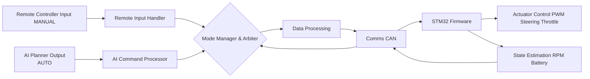

# Vehicle Software Architecture Documentation

## Overview

This project implements a **small research car** software stack using two computing platforms:

- **STM32 Microcontroller** – handles **low-level real-time control**, sensing, and safety-critical tasks.
- **Raspberry Pi 5 + Halo AI Hat** – handles **high-level perception, decision-making, ADAS features, and user interface**.

The software is organized to separate **hardware abstraction, control, perception, planning, and ADAS functionality**. This allows maintainability, testability, and modular development.

---

## High-Level Architecture

### STM32 (Real-Time Control & Sensing Layer)

Responsibilities:

- Real-time motor and steering control
- Sensor reading and state estimation
- Safety monitoring
- Communication with Raspberry Pi

```
STM32 (Real-Time Control & Sensing layer)
├── Drivers (PWM, I2C, CAN)
├── Sensors
├── Vehicle State Estimation
├── Motor/Actuator Control
├── Safety Supervisor (Critical)
└── CAN Communnications Interface
```


### Raspberry Pi 5 (High-Level Decision Making & Application Layers)

Responsibilities:

- Perception from cameras and other sensors
- Vehicle state fusion and world modeling
- ADAS features: AEB, ACC, LDW, TSR, Blind-Spot Detection, Parking Assist
- Planning and decision-making
- Display
- Remote control
- Communication with STM32

```
Raspberry Pi 5 (High-Level Decision Making & Application Layers)
├── Perception (Vision, Object Detection, Lanes)
├── World Model (tracking, mapping)
├── ADAS Modules (AEB, ACC, LDW, TSR…)
├── AI Planning / Decision Engine
├── Cluster
├── Remote Control
├── Mode management
└── CAN Communnications Interface
```


---

## STM32 Software Modules

### 1. Drivers

Low-level hardware access, abstracting MCU peripherals.

- `pwm_driver.c/.h` – generates PWM for throttle, steering, brakes  
- `encoder_driver.c/.h` – reads wheel speed / RPM  
- `can_driver.c/.h` – CAN bus communication  
- `i2c_driver.c/.h` – IMU, magnetometer, current sensors  

> **Note:** Drivers do not implement control logic. They expose simple APIs for higher layers.

### 2. Control

High-level control of vehicle actuators.

- `throttle_controller.c/.h` – converts target speed to PWM using PID  
- `steering_controller.c/.h` – controls steering angle via PWM  
- Interfaces with the `pwm_driver` for hardware actuation  

### 3. Sensors

- Battery monitoring, wheel encoders, IMU, and other sensors  
- Implements filtering and preprocessing for clean data  

### 4. Vehicle State Estimation

- Computes vehicle speed, odometry, yaw rate, and other state variables  
- Feeds information to Raspberry Pi or local control loops  

### 5. Safety Supervisor

- Emergency stop / watchdog functionality  
- Limits actuator commands to safe ranges  

### 6. Communication Interface

- CAN, UART, or serial interface to Raspberry Pi  
- Structured message exchange (vehicle state ↔ control commands)

---

## Raspberry Pi Software Modules

### 1. Perception

- Captures camera images and sensor data  
- Performs object detection, lane detection, traffic sign recognition  
- Runs AI models (GPU/NPU optimized)  

### 2. World Model / Sensor Fusion

- Tracks detected objects and vehicle state  
- Combines sensor data to form a coherent representation of surroundings  
- Optional: visual odometry, SLAM, GPS fusion  

### 3. ADAS Modules

Modular features that consume the world model:

- Automatic Emergency Braking (AEB)  
- Lane Departure Warning (LDW)  
- Adaptive Cruise Control (ACC)  
- Traffic Sign Recognition (TSR)  
- Blind-Spot Monitoring (BSM)  
- Parking Assistance (PA)  

> Each module is independent, receives preprocessed perception output, and generates commands or warnings.

### 4. Planning / Decision Engine

- Computes control decisions: speed, steering, braking  
- Arbitrates between multiple ADAS modules  
- Sends commands to STM32

### 5. Cluster

- Dashboard display: speed, camera overlays, ADAS feedback  
- Optional web or GUI interface

### 6. Comms Middleware

- Sends control commands to STM32  
- Receives vehicle state, sensor data, and health information  
- Ensures safe and synchronized data exchange

### 7. Mode Manager
- Manages the different modes: FAILSAFE, TEST, MANUAL, AUTO
- Overrides AUTO with MANUAL for remote input priority control


---

## Data Flow Diagram




---

## Folder Structure

```
/apps
├── stm32-firmware/
│ ├── drivers/ # PWM, CAN, I2C, SPI, UART
│ ├── control/ # Throttle, Steering controllers, PID/MPC
│ ├── sensing/ # Sensor preprocessing, state estimation
│ ├── safety/ # Watchdog, E-stop
│ ├── comms/ # CAN/UART message handling
│ └── app/ # Main loop
├── rpi-software/
│ ├── perception/ # Camera capture, object/lane detection
│ ├── fusion/ # Sensor fusion, tracking, mapping
│ ├── adas/ # Individual ADAS features
│ ├── planning/ # Path planning and decision engine
│ ├── comms/ # Sends commands to STM32
│ ├── mode_manager/
│ ├──├── remote/
│ ├──├── auto/
│ ├──├── manager.c
│ ├── cluster/ # Dashboard, overlays
│ └── configs/ # AI models, thresholds, calibration
└── README.md
```
