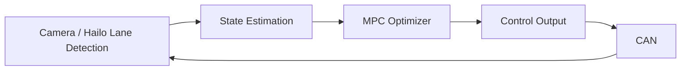
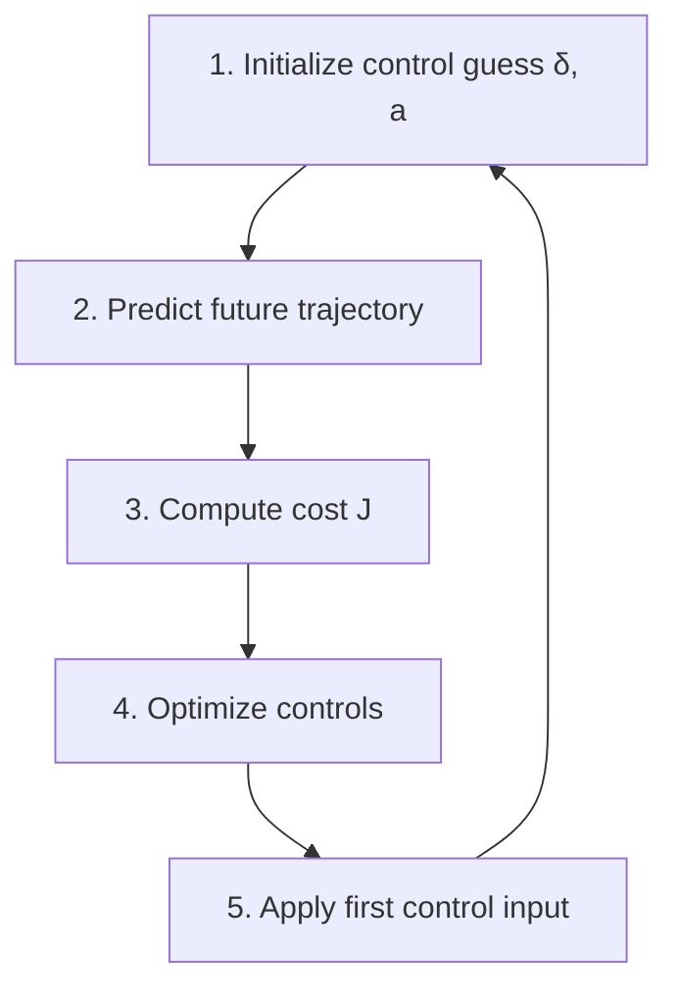

# Model Predictive Control (MPC)

Model Predictive Control (MPC) is an advanced control method used to optimize system behavior while respecting constraints. It relies on a dynamic model of the system (e.g., bicycle model), typically derived from system identification or physics-based modeling.

The key idea is to optimize over a finite horizon, but only apply the first control input, then repeat the process at the next timestep (receding horizon control). This differs from classical controllers like LQR.

---

## System Overview

---

## Scope

- Lane perception is performed using Hailo inference (binary lane masks)
- Vehicle state is extracted:
  - e_y: lateral offset from lane center
  - ψ_error: heading error
  - v: velocity
- MPC computes:
  - steering angle δ
  - acceleration a
- Acceleration can be implemented via PID or direct throttle control

---

## Goals

- Respect physical constraints:
  - max steering angle
  - max speed
  - potentially: drivable area (obstacle avoidance)
- Improve smoothness of turns
- Account for curvature via velocity adaptation
- We can potentially introduce a global planner as a constraint, allowing us to optimize the path from A to B

---

## MPC Loop (High-Level)

---

## Detailed Algorithm

## 1. Initialization: State and Control Guess

Each cycle begins with measured state:

[ $e_y$, $ψ_{error}$, $v$]

Initial control sequence:

{δ0, a0, δ1, a1, ..., δN-1, aN-1}

---

## 2. Trajectory Prediction (System Dynamics)

$$e_{y,k+1} = e_{y,k} + v_k sin(ψ_error,k) Δt$$
$$ψ_{error,k+1} = ψ_{error,k} + (v_k / L) tan(δ_k) Δt$$
$$v_{k+1} = v_k + a_k Δt$$

---

## 3. Cost Evaluation

$$J = \sum(Q_e e_y^2 + Q_ψ ψ_error^2 + Q_v (v - v_ref)^2 + R_δ δ^2 + R_a a^2)$$

---

## 4. Iterative Optimization
The optimizer improves the control sequence:

$$u^{(i+1)} = u^{(i)} - α ∇J$$

or via QP/SQP methods.

Constraints applied:

- $$∣δ_k∣≤δ_{max}$$
- $$∣a_k∣≤a_{max}$$
- steering rate limits

---

## 5. Execution (Receding Horizon)

Apply only:

[ $δ0$, $a0$]

---

## Key Insight

MPC continuously replans by predicting future behavior and optimizing only the first control action.
